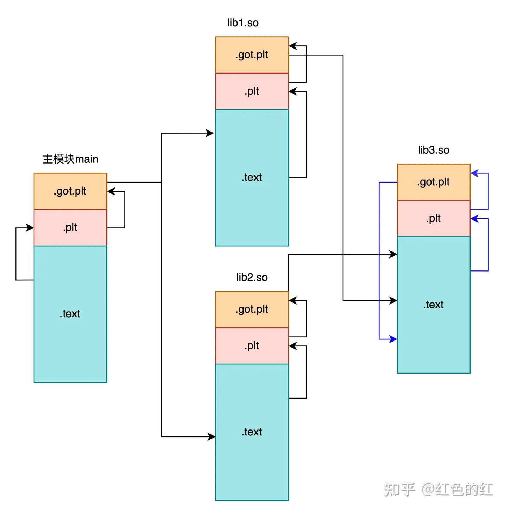

使用gcc版本：
```
╰─ gcc --version
gcc (Ubuntu 9.4.0-1ubuntu1~20.04.2) 9.4.0
Copyright (C) 2019 Free Software Foundation, Inc.
This is free software; see the source for copying conditions.  There is NO
warranty; not even for MERCHANTABILITY or FITNESS FOR A PARTICULAR PURPOSE.
```


## plt + got
在hello_c目录下：
```sh
╰─ gcc -shared -fPIC -o lib/libhello.so lib/src/hello.c -Ilib/include

╰─ readelf -S main | egrep  '.plt|.got'
  [11] .rela.plt         RELA             0000000000000648  00000648
  [13] .plt              PROGBITS         0000000000001020  00001020
  [14] .plt.got          PROGBITS         0000000000001050  00001050
  [15] .plt.sec          PROGBITS         0000000000001060  00001060
  [24] .got              PROGBITS         0000000000003fd8  00002fd8
  [25] .got.plt          PROGBITS         0000000000004000  00003000
```
这里看其中的`.plt.sec .got.plt`，其他的我暂时也不太理解含义
```sh
╰─ objdump -d main -j .plt.sec
main:     file format elf64-x86-64

Disassembly of section .plt.sec:

0000000000001060 <printf@plt>:
    1060:       f3 0f 1e fa             endbr64 
    1064:       f2 ff 25 ad 2f 00 00    bnd jmpq *0x2fad(%rip)        # 4018 <printf@GLIBC_2.2.5> #%rip为PC
    106b:       0f 1f 44 00 00          nopl   0x0(%rax,%rax,1)

0000000000001070 <hello@plt>:
    1070:       f3 0f 1e fa             endbr64 
    1074:       f2 ff 25 a5 2f 00 00    bnd jmpq *0x2fa5(%rip)        # 4020 <hello>
    107b:       0f 1f 44 00 00          nopl   0x0(%rax,%rax,1)


╰─ objdump -d main -j .got.plt
main:     file format elf64-x86-64

Disassembly of section .got.plt:

0000000000004000 <_GLOBAL_OFFSET_TABLE_>:
    4000:       e8 3d 00 00 00 00 00 00 00 00 00 00 00 00 00 00     .=..............
        ...
    4018:       30 10 00 00 00 00 00 00 40 10 00 00 00 00 00 00     0.......@.......
```
观察`.plt.sec`的内容，共有2项，每一项并不是一个指针，而是一段代码，`endbr64`是intel防止缓冲区溢出等攻击提出的指令，`nopl   0x0(%rax,%rax,1)`为空操作；唯一有用的是`bnd jmpq *0x2fad(%rip) `，含义为从GOT表(`0x2fad(%rip)`)中取出目标地址并跳转。


观察`got.plt`即GLOBAL_OFFSET_TABLE(GOT)，从0x4000起始，到0x4028结束，共5项 40个字节：
- 其中0x4018和0x4020这两项将要填充的是printf和hello的函数地址。前面3项的作用未知。
- GOT中目前是无意义的数据，因为只有elf被加载到内存中时，真正函数地址才会被写到GOT中。这个时机可以是elf加载时，或者符号使用时（延迟绑定），详见后文。


继续objdump代码段，观察**代码段**如何和plt、got交互的：

>这里省略了.text其他部分，只保留了main函数。其他部分不关注

```sh
╰─ objdump -d main -j .text
main:     file format elf64-x86-64
Disassembly of section .text:

0000000000001169 <main>:
    1169:       f3 0f 1e fa             endbr64 
    116d:       55                      push   %rbp
    116e:       48 89 e5                mov    %rsp,%rbp
    1171:       b8 00 00 00 00          mov    $0x0,%eax
    1176:       e8 f5 fe ff ff          callq  1070 <hello@plt>
    117b:       8b 05 b7 2e 00 00       mov    0x2eb7(%rip),%eax        # 4038 <time>
    1181:       89 c6                   mov    %eax,%esi
    1183:       48 8d 3d 7a 0e 00 00    lea    0xe7a(%rip),%rdi        # 2004 <_IO_stdin_used+0x4>
    118a:       b8 00 00 00 00          mov    $0x0,%eax
    118f:       e8 cc fe ff ff          callq  1060 <printf@plt>
    1194:       b8 00 00 00 00          mov    $0x0,%eax
    1199:       5d                      pop    %rbp
    119a:       c3                      retq   
    119b:       0f 1f 44 00 00          nopl   0x0(%rax,%rax,1)
```

由于hello和printf都是外部函数，所以这里会调用`.plt.sec`的代码，而`.plt.sec`会查GOT表，跳转到正确的地址。

## Q：为什么要使用plt和got间接跳转？可以直接挑战吗
可不可以不用plt+got，而是在加载动态库时，根据加载的地址，改写.text中的callq的目标地址？

不行，有3点弊端：
- `.text`一般不允许改写，存在安全威胁和漏洞。
- 在不同进程中，动态库的地址都是不同的并且动态库在所有进程中共享，直接改写`.text`会对所有进程的`.text`造成影响，这就违背了动态库共享的目的。
- 假设一个so中对printf有100k次调用，如果直接改写`.text`，那么100k次调用都需要改写；而采用plt+got，只用改写一次。


## Q：一个进程中，不同so和main之间的got、plt是共享的吗？
这个我觉得是可以合并的，一个进程只有一张merged的plt、got表。但是，我通过gdb看到的，每个so有自己的plt和got。而且，如果不是独立的，cuda_mock就无法根据so的名字筛选要被替换的got表了


图源：https://zhuanlan.zhihu.com/p/558522498

## Q：不同进程中，同一个so的got、plt是共享的吗？
got肯定不是共享的，so在不同的进程中，加载的位置不一样，got中存放的地址也不一样。但是plt呢？不确定。

## Q：为什么要使用2层跳转，而不是.text直接从GOT中查表，只一层跳转？
不清楚，TODO

## Q：延迟绑定生效吗？
其实默认gcc是不启用lazy binding的，需要手动开启。

#### 实验1 gcc默认不启用lazy binding

```sh
cd hello_c
#正常编译libhello.so
gcc -shared -fPIC -o lib/libhello.so lib/src/hello.c -Ilib/include
#正常编译main，-g是为了调试
gcc  -g  main.c -o main -Llib  -lhello -Ilib/include
#编译一个没有hello符号的so，名字也叫libhello.so
gcc -shared -fPIC -o lib_renamed/libhello.so lib_renamed/src/hello.c -Ilib_renamed/include
#指定使用没有hello符号的so，进入gdb
LD_LIBRARY_PATH=`pwd`/lib_renamed:$LD_LIBRARY_PATH gdb ./main
(gdb) b main
Breakpoint 1 at 0x1169: file main.c, line 5.
(gdb) r
Starting program: /home/github/cpp-cuda-py-torch-mlir/cpp/compile_link/plt_got_lazy_binding/hello_c/main 
/home/github/cpp-cuda-py-torch-mlir/cpp/compile_link/plt_got_lazy_binding/hello_c/main: symbol lookup error: /home/github/cpp-cuda-py-torch-mlir/cpp/compile_link/plt_got_lazy_binding/hello_c/main: undefined symbol: hello
```

可以看到，还没有进入到main，更没有调用hello，就报错了；这说明不是延迟绑定

#### 实验2 gcc启用lazy binding

```sh
# ... 前面步骤一样
#正常编译main，-g是为了调试
gcc -z lazy -g  main.c -o main -Llib  -lhello -Ilib/include
# ... 后面步骤一样，同样使用错误的so，启动gdb
LD_LIBRARY_PATH=`pwd`/lib_renamed:$LD_LIBRARY_PATH gdb ./main 
(gdb) b main
Breakpoint 1 at 0x1169: file main.c, line 5.
(gdb) r
Starting program: /home/github/cpp-cuda-py-torch-mlir/cpp/compile_link/plt_got_lazy_binding/hello_c/main 

Breakpoint 1, main () at main.c:5
5       int main() {
```
这次在进入main之后，也没有报错。继续单步，调用hello：
```sh
(gdb) n
6           hello(); // 调用库中的函数
(gdb) n
/home/github/cpp-cuda-py-torch-mlir/cpp/compile_link/plt_got_lazy_binding/hello_c/main: symbol lookup error: /home/github/cpp-cuda-py-torch-mlir/cpp/compile_link/plt_got_lazy_binding/hello_c/main: undefined symbol: hello
[Inferior 1 (process 106339) exited with code 0177]
```
当真正调用到hello时，触发延迟绑定，才报错了。

可以通过`LD_BIND_NOW=1 LD_LIBRARY_PATH=`pwd`/lib:$LD_LIBRARY_PATH gdb ./main`强制不使用延迟绑定。但是不能通过`LD_BIND_NOW=0 LD_LIBRARY_PATH=`pwd`/lib:$LD_LIBRARY_PATH gdb ./main` 强制不使用延迟绑定。


#### 参考
为什么默认不启用lazy binding？可能是安全因素

https://stackoverflow.com/questions/62527697/why-does-gcc-link-with-z-now-by-default-although-lazy-binding-is-the-default

> When BIND_NOW is enabled, all symbols will be resolved before executing the program code. The .got.plt section is merged into .got section by ld. The ld.so changes the .got section to read-only before calling program entry point.


## Q：编译、链接时，需要动态库的头文件和so吗？

头文件编译时需要，通过 -I 指定查找目录。

so链接时需要，通过 -L 指定查找目录，通过-l指定so名字。但是为什么？如果没有的话可以链接吗？感觉也可以。。。

